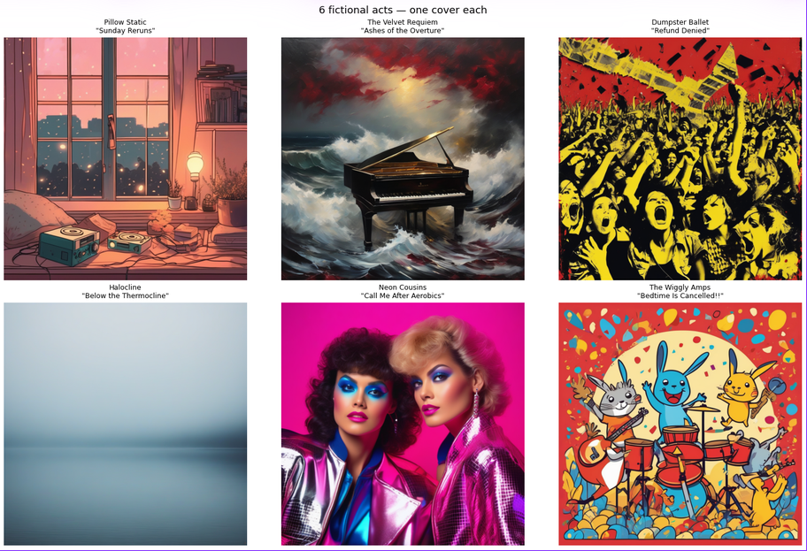
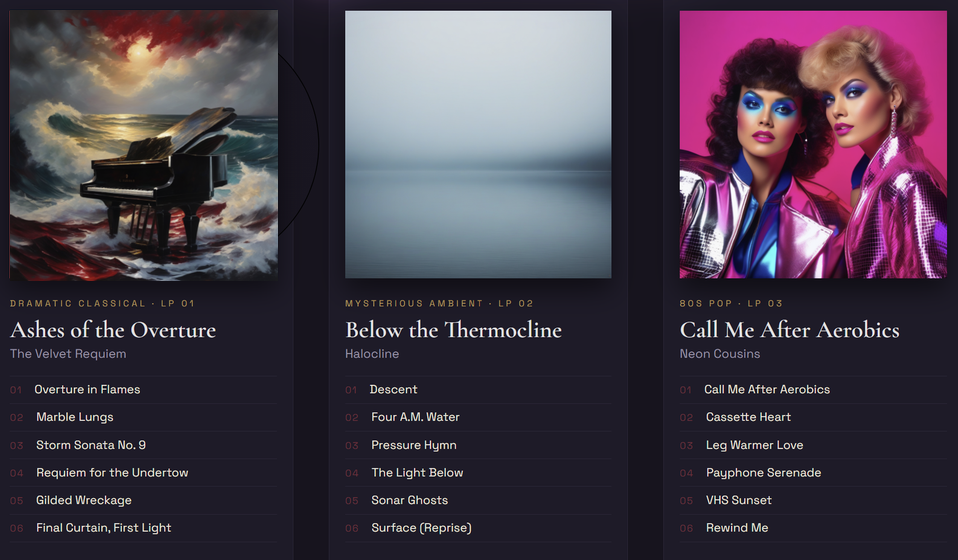

# AI DJ - Turn a Vibe into an Album Cover

[](https://huggingface.co/stabilityai/stable-diffusion-xl-base-1.0)
[](https://huggingface.co/black-forest-labs/FLUX.1-schnell)
[](https://huggingface.co/meta-llama/Llama-4-Scout-17B-16E-Instruct)


Two ways to run the same project:
| Mode | Files | Needs | Best for |
|---|---|---|---|
| **🌐 Browser app** | `index.html` + `style.css` + `app.js` | a free HuggingFace token, nothing to install | interactive demo, curating favourites |
| **🐍 Colab** | `notes.txt` / `AI_DJ_album_covers.ipynb` | a GPU (Colab T4 is enough) | full assignment run with SDXL, reproducible seeds |

The notebook runs Stable Diffusion XL (`stabilityai/stable-diffusion-xl-base-1.0`) on a GPU and covers the whole assignment end-to-end. The browser app, in contrast, uses two HuggingFace endpoints, called directly from JavaScript:

1. **Text-to-image** (default: `black-forest-labs/FLUX.1-schnell`, via the `hf-inference` provider) - generates the album covers.
2. **Vision-language chat model** (default: `meta-llama/Llama-4-Scout-17B-16E-Instruct`, via HuggingFace's OpenAI-compatible router with automatic provider selection) - looks at a favourite cover and invents a fake album title + 5-song tracklist for it.

## How to run (browser app)

1. Create a free account on [huggingface.co](https://huggingface.co) if you don't have one.
2. Go to [huggingface.co/settings/tokens](https://huggingface.co/settings/tokens) and create a **Read** token.
3. Serve the folder with a local server (some browsers block `fetch` from a page opened directly as `file://`):

   ```
   cd AIDJ
   python -m http.server 8000
   ```

   then open `http://localhost:8000`. (Or use the VS Code "Live Server" extension.)
4. In **⚙️ API Settings**, paste your token and click "Save settings".

## 🎨 Generating covers

Pick one of the 6 built-in acts from the dropdown (or *Custom act…* to write your own), optionally edit the artist/genre/prompt, choose the number of variants and generate!

Each variant uses the same prompt with a different random seed, and every generation replaces the previous results instead of stacking. A "no text" instruction is appended automatically so covers come out without lettering; each result can be downloaded with or added straight to favourites.

Every prompt of the 6 acts explicitly encodes **style, colors, mood and imagery**. Here is one cover per act, generated by the Colab notebook (SDXL, fixed seed 42):



The prompt controls *what* and *in which style*; the seed controls the specific *composition*.

**Stays the same** (prompt): subject (grand piano, storm), color palette (crimson / black / gold), painterly chiaroscuro style, overall dramatic mood.
**Changes**: composition and camera angle, placement of the statues, wave shapes and detail, lighting balance.

## ⭐ Favourites + fake album titles & tracklists




For each favourite, a fake album title and tracklist can be generated in one of two ways:

- **✨ AI**: the cover (base64) is sent to the vision model together with the act's genre and a strict-JSON requirement (`{"album": "...", "tracks": [...]}`). The model actually looks at the image, so titles match its content - but each call spends a bit of the shared monthly HF Inference credits.
- **🎲 Random**: a local, offline fallback: `Math.random()` combines words from three small pools (adjectives, album nouns, track nouns) into a title and five tracks. Instant and unlimited, but it never sees the image, so results are generic.

The two modes illustrate a trade-off: content-aware quality that costs credits versus an instant, free fallback that keeps curation working even when credits run out.